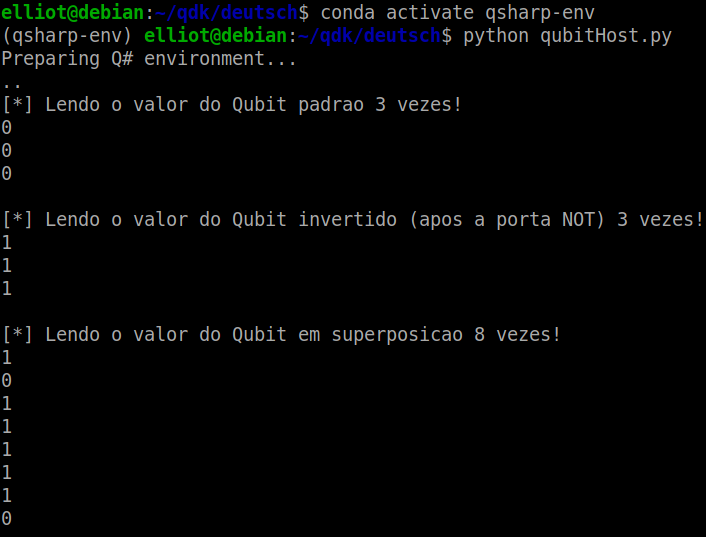
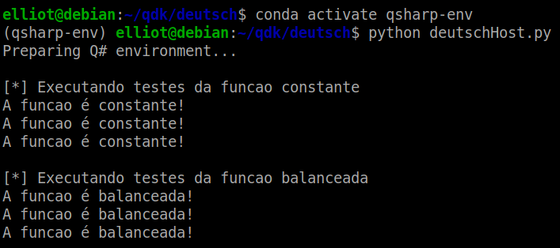

# Criação e Entendimento de Qubits e Aplicação do Algoritmo de Deutsch (QDK)
## Autor: Luan Fellipe (allen08)
### Linguagens: QSharp e Python
### Plataforma: QDK

Programas de Entendimento do funcionamento do kit de desenvolvimento quântico da Microsoft (QDK) e exemplo com o algoritmo quântico de Deutsch. 

### [*] Necessário:
    - Sistema GNU_Linux x86_64 (Usado: Debian 5.10) Ou Windows 10.
    - Microsoft QDK (https://docs.microsoft.com/pt-br/azure/quantum/install-overview-qdk).
    - Anaconda (https://docs.anaconda.com/anaconda/install/windows).
    - Visual Studio Code ou Editor de Texto para QSharp.

### [*] Execuções:
**Qubits Exemplos:**

**Algoritmo Deutsch Exemplo:**

